# Whether Unsupervised Depth and Optical Flow Help Few Shot Supervised Learning

## Requirement
- PyTorch >=0.4.0
- Python 2.x

## How to run the code
You only need to use 4 folders (mlt_attn, viper, kitti_det2, cityscape) and they are all independent.

### kitti_det2:
1. Open `set_env.sh`, change `DATA_PATH` and `CODE_PATH` to your own kitti data and code path
2. Go to `scripts` folder, run `base.sh`

### cityscape:
1. Open `set_env.sh`, change `DATA_PATH` and `CODE_PATH` to your own cityscape data and code path
2. Go to `scripts` folder, run `base.sh`

### vdrift:
1. Go to `prepare` folder, open `create_seg_class.py` and  change `seg_path` and `seg_cls_path`, then run it. 
2. Open `set_env.sh`, change `DATA_PATH` and `CODE_PATH` to your own vdrift data and code path.
3. Go to `scripts` folder, run `base.sh`

### mlt_attn:
1. Open `mlt_data.py`, change `self.img_dir`, `self.depth_dir`, `self.box_dir` to your own mlt data path.
2. Go to `exps`, run `base.sh` 

## Motivation
Although deep neural networks have achieved promising results on visual recognition, human uses much fewer supervised training labels to reach to the same level performance. In this work, we study how much depth, optical flow help object recognition, localization, detection and segmentation in cluttered scenes, particularly when there are not enough training labels.
- There is an intuition that depth can significantly help attention and detection for objects in clutted scenes. There is also another intuition that optical flow can help to attention to the moving objects.
- To obtain depth and flow, we use ground truth existed in the some datasets (i.e. [MLT](http://robots.princeton.edu/projects/2016/PBRS/), [VDrift](http://www.cvlibs.net/datasets/kitti/)). For other real world datasets ([KITTI](http://www.cvlibs.net/datasets/kitti/), [CityScape](https://www.cityscapes-dataset.com/)), we use the unperfect unsupervisedly learned depth and optical flow estimation from [Joint Unsupervised Learning of Optical Flow and Depth by Watching Stereo Videos](https://arxiv.org/abs/1810.03654).

## Problem Setting
Our ultimate goal is to study how much depth and optical flow can help high level semantic level tasks such as object recognition, localization, detection and segmentation, particularly when there are not enough training data. Hence our problem setting is below:
1. Given a direction keyword (i.e. "top left") and a cluttered RGB image (with or without depth & optical flow), how is the recognition accuracy improves?
2. Given an object keyword (i.e. "television") and a cluttered RGB image (with or without depth & optical flow), how is the localization accuracy improves?
3. Given a few supervised training labels, how does the unsupervised depth & optical flow help recognition / localization / detection /segmentation accuracy?

## Benchmark & Criteria
We use the standard benchmark accuracy as the quantitative measure:
1. The recognition benchmark is very simple, it is the classification accuracy.
2. The localization benchmark is same as recognition, using key words (i.e. "top left") to represent a location and then use classification accuracy.
3. We will further replace the localization problem to another word prediction problem (i.e. left, right, top, down, etc.), then we will merge the two tasks into one task which is word prediction (i.e. car, pedestrian or left, right). We will then use the word prediction accuracy as the final measure.
4. The detection benchmark is the mean average precision, where a bounding box is considered as correct if its IoU with the ground truth box is over 50%. 
5. The segmentation benchmark is the mean IoUs, which is the average intersection over union.

## Dataset
We mainly use four datasets for experiments.
1. [MLT dataset](http://robots.princeton.edu/projects/2016/PBRS/): This is the main dataset we use to study depth effect because they contain ground truth object semantic segmentation, instance segmentation, depth, etc. MLT dataset contains 45K synthetic 3D indoor scenes with 400K fully annotated rendered images from different viewpoints.
2. [KITTI dataset](http://www.cvlibs.net/datasets/kitti/): This is one standard dataset to use for detection evaluation. It also evaluates depth and flow.
3. [VDrift dataset](http://campar.in.tum.de/Chair/ProjectSyntheticDataset): This is a synthetic dataset for semantic segmentation with ground truth depth and flow. 
4. [CityScape dataset](https://www.cityscapes-dataset.com/): This is another standard dataset to use for segmentation evaluation. It does not contain depth and flow.

Some other dataset not used in the final experiments. 
1. [Mnist dataset](http://yann.lecun.com/exdb/mnist/): This is simply for debug model and code.
2. [VIPER dataset](http://playing-for-benchmarks.org/): This is the other main dataset we use to study optical flow effect because they contain ground truth object semantic segmentation, instance segmentation, optical flow, etc. VIPER dataset contains 250K fully annotated high resolution video frames.

| Datast | MLT | KITTI | VDrift | CityScape |
| ------ | ------ | ------ | ------ | ------ | 
| Task   | Recognition / Localization | Detection | Segmentation | Segmentation |
| Data   | RGB + D | RGB | RGB + D + F | RGB |
| Stereo | No | Yes | No | Yes |
| GT Depth | Yes | No | Yes | No |
| GT Flow | No | No | Yes | No |
| # Train |10743 | 5985 | 1265 | 2975 | 
| # Test | 4604 | 1496 | 316 | 500 |

## Model
We use different models on different tasks. In general, we use attention models for recognition and localization
1. We find it is straightforward to use the attention models for recognition and localization. There are two variations of attention models: 
(1) Hard attention models such as [Spatial Transformer Networks](http://torch.ch/blog/2015/09/07/spatial_transformers.html) and [Recurrent Model of Visual Attention](http://torch.ch/blog/2015/09/21/rmva.html).
(2) Soft attention models such as [Show, Attend and Tell](http://kelvinxu.github.io/projects/capgen.html). In this work, we also study the effect of these two different attention models on the recognition and localization tasks.
2. We use fully convolutional networks with skip connections upsampling for detection and segmentation.

## Preliminary Results

### 5/3/2018
- Summarize the performance of using the bounding box to align v.s. no aligned and using RGB + depth v.s. RGB only, on [MLT dataset](http://robots.princeton.edu/projects/2016/PBRS/) with 7000 training images and 700 testing images for 6 most frequent classes. 
- Try to train a residual network to beat the previous VGG network, but residual network obtains worse performance on all different tasks. Need to figure out why.

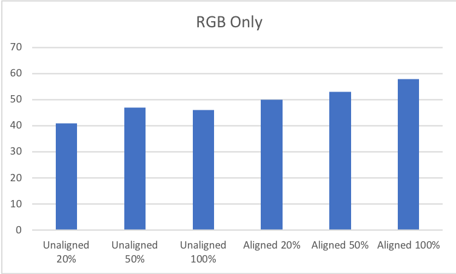 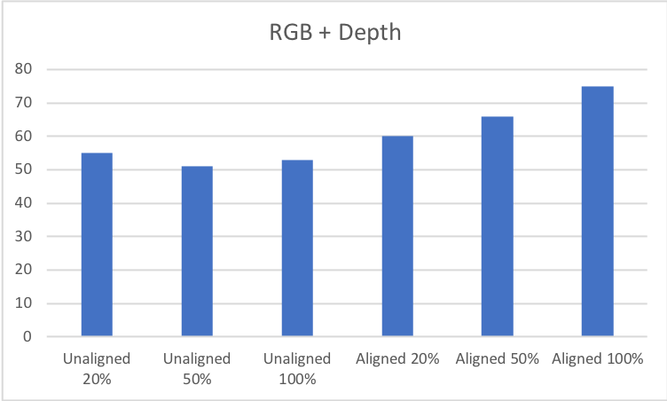 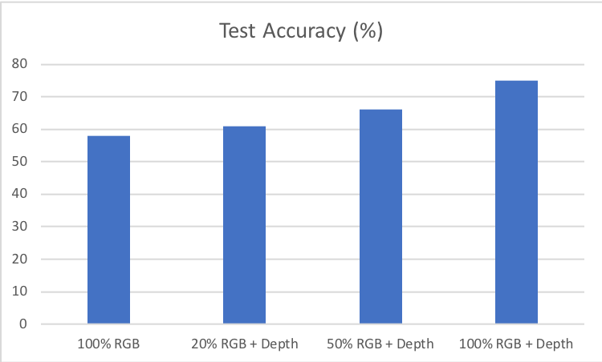 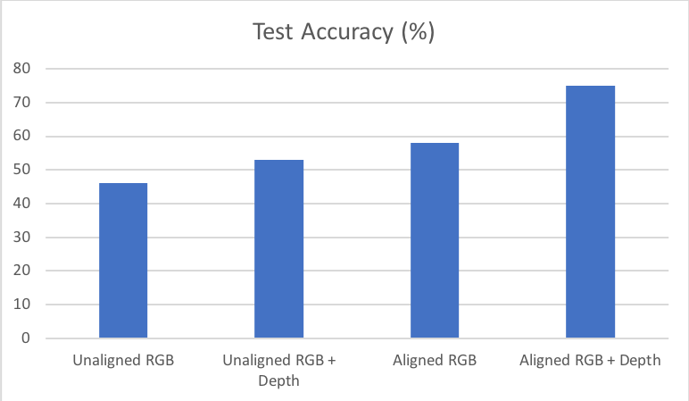 

### 5/10/2018
- To make training/testing more stable, we now use 10742 training images and 4605 testing images for 6 most frequent classes on [MLT dataset](http://robots.princeton.edu/projects/2016/PBRS/).
- Performance summarization: Random guess is 25%, brute-forcely train with only image 40%, brute-forcely train image with box 62%, suggesting a high location prior in the image, spatial transformer attention crop with gt box 69%.
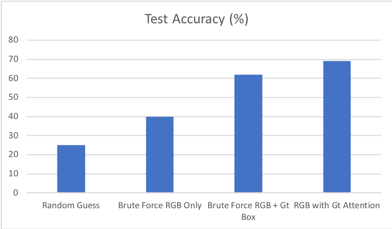

### 5/17/2018
- The hard attention model (Spatial Transformer Networks) does not work on MLT dataset so far. I find the model struggling in finding the correct object location and is very sensitive to initialization.
- Debug Spatial Transformer Networks on Mnist dataset and find it even fails on simple Mnist data.
 
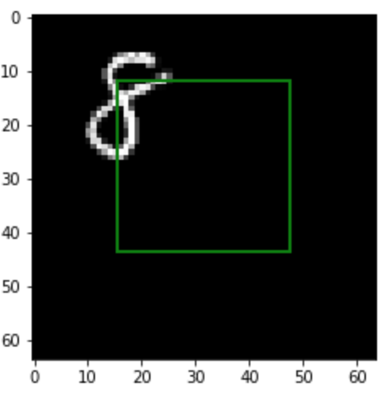 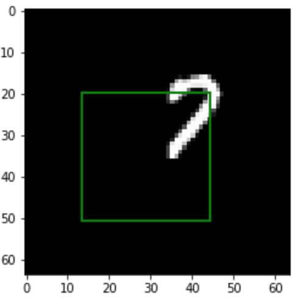 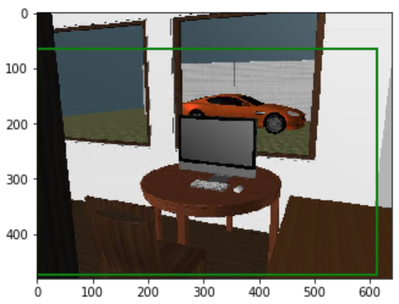 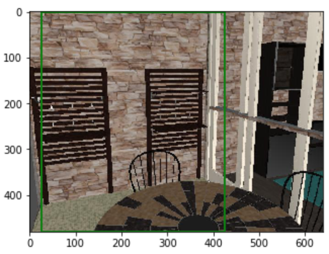

### 5/24/2018
- The Spatial Transformer Networks can work on Mnist dataset now, when Mnist digits are randomly uniformly located in the image. Both image-based attention and word-based attention can provide reasonable attention. Jointly training with them can achieve even better and faster convergence on learning classifiers and attention models.

 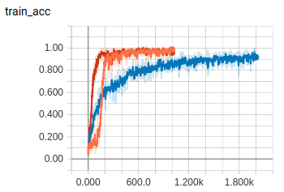 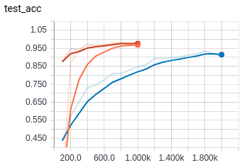

### 5/31/2018
- Conduct comparison between hard attention model and soft attention model on Mnist dataset. 
- Conclusion: using soft attention model performs much smoother and faster convergence than previous hard attention model (Spatial Transformer Networks). The oracle performance of soft attention model may be worse than the best hard attention model on recognition, however, in reality training converges much smoother.
- Here I show the training convergence using the soft attention model and a baseline hard attention model (orange) on Mnist dataset. One can see the three (red, cyan, gray) soft-attention curves all converge much faster than the (orange) hard-attention (Spatial Transformer Networks) curve. For more hard attention model performances, please see the last week (5/24/2018) note.

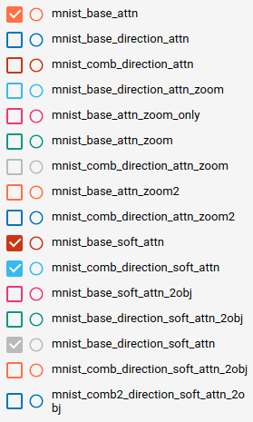 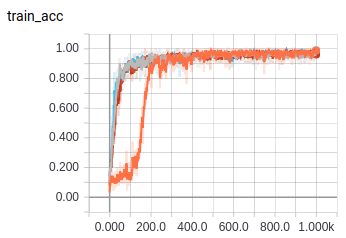 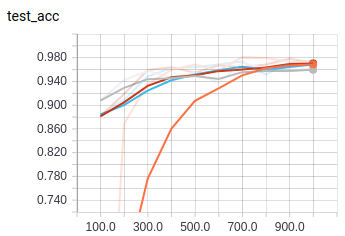

### 6/7/2018

- Now consistently use soft attention model and switch back to MLT dataset because Mnist dataset is too simple.
- On MLT dataset, there are two main promising conclusions: 
1. Adding depth significantly helps image recognition. For example, the testing recognition accuracy increases from 42% to 48% by adding depth. And after adding top-down direction signal, the testing accuracy further increases from 48% to 72% which is about 30% total absolute improvement to the baseline RGB only.
2. Adding top-down direction as keyword to obtain attention significantly helps image recognition. For example, the testing recognition accuracy increases from 48% to 61% by adding top-down direction on RGB image.
- In total, the depth and direction keyword can significantly improve recognition accuracy from 42% to 72%, increasing 30%, and the training actually has not converged yet. And all curves haven't converged yet.

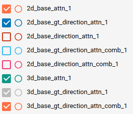 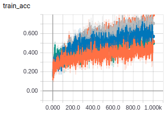 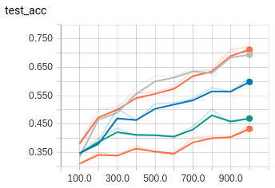
<figure>
 <figcaption>Input multiple scale images (256x256 + 128x128)</figcaption>
 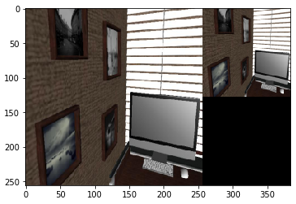
</figure> 
<figure>
 <figcaption>Attention maps (8x8 + 4x4)</figcaption>
 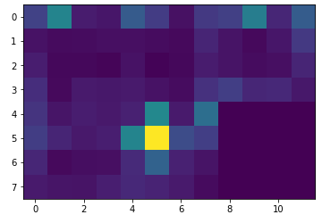
</figure>
